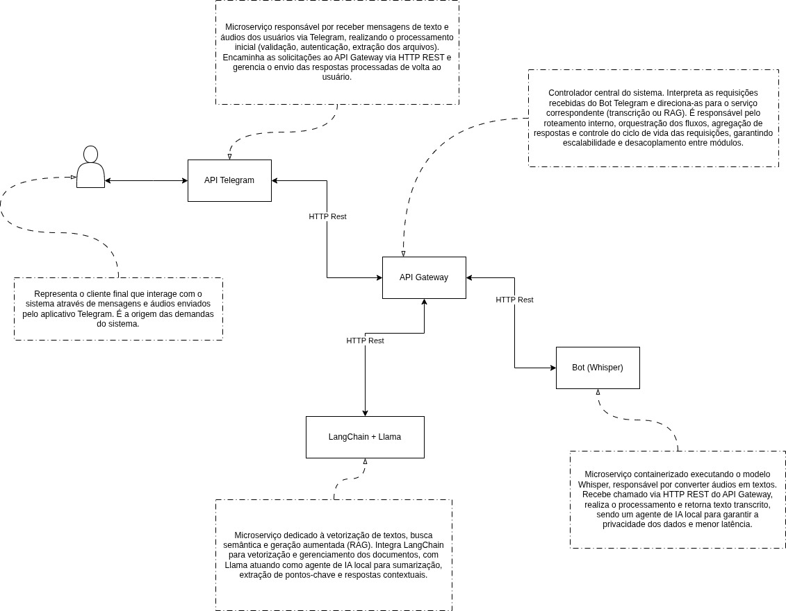

# 🧠 Sistema Distribuído para Análise Inteligente de Áudios de Reuniões

Este repositório contém o sistema desenvolvido pelo grupo de estudos **NIAD (Núcleo de Inteligência Artificial e Ciência de Dados)** como projeto acadêmico da disciplina **Sistemas Distribuídos** da **UFLA**.

O objetivo do sistema é realizar a **análise inteligente de áudios de reuniões recebidos via Telegram**, utilizando **múltiplos agentes de Inteligência Artificial** orquestrados em **microserviços containerizados**.

---

## 🚀 Principais Funcionalidades

### 🤖 Integração via Telegram

O **bot** atua como interface principal do sistema, recebendo áudios de reuniões dos usuários e enviando os resultados processados.

### 🎙️ Transcrição de Áudio (Whisper)

Microserviço **local e containerizado**, responsável por converter áudios em texto com o modelo open source **Whisper**, garantindo **privacidade e eficiência** no processamento.

### 🧩 Vetorização e Consulta Inteligente (LangChain + Llama)

Microserviço de **RAG (Retrieval-Augmented Generation)** que executa a **vetorização dos textos**, **busca semântica**, **sumarização dos tópicos principais** e **geração de respostas inteligentes** usando **LLMs como Llama**.

### 🌐 API Gateway (Express.js)

Coordena o fluxo de dados entre os microserviços, centralizando o controle das requisições e assegurando **escalabilidade, segurança e flexibilidade**.

### 🐳 Containerização com Docker

Todos os componentes são **distribuídos em containers Docker**, facilitando **implantação, testes, manutenção e portabilidade** entre diferentes ambientes.

---

## Arquitetura do Projeto

---

## 🧱 Justificativa da Arquitetura Utilizada

A arquitetura foi projetada para atender aos requisitos de um **sistema distribuído moderno, seguro e escalável**, utilizando múltiplos agentes de IA de forma **orquestrada e independente**.

O uso de um **API Gateway** como controlador central permite o **desacoplamento lógico** entre os módulos, simplificando manutenção, escalabilidade e atualizações dos microserviços.

A separação dos agentes de IA em **serviços distintos** — um dedicado à **transcrição (Whisper)** e outro à **vetorização/RAG (LangChain + Llama)** — cumpre os requisitos acadêmicos e oferece **flexibilidade para evolução tecnológica**, como a substituição ou atualização dos modelos de linguagem no futuro.

O **Bot do Telegram** foi escolhido por sua acessibilidade e ampla adoção, tornando a interação com o sistema intuitiva.
O uso de **containers Docker** garante **isolamento, reprodutibilidade e portabilidade**, permitindo fácil implantação em diversos ambientes.

Além disso, as tecnologias adotadas são **gratuitas, open source e bem documentadas**, o que reduz a complexidade de desenvolvimento sem comprometer a robustez e a inovação do sistema.

Por fim, o **desenho modular** favorece a aplicação de **conceitos de segurança, validação de problema e documentação arquitetônica**, além de servir como **base sólida para futuras melhorias**, expansão de funcionalidades e integração de novos agentes de IA.
